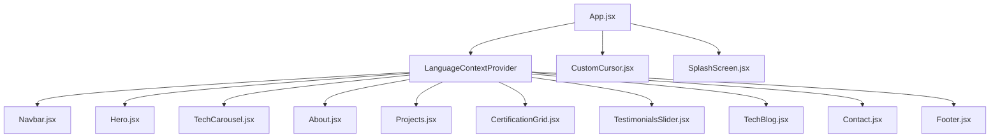

# ⚡ Leo Syafiq | Premium Bilingual Personal Portfolio

An ultra-premium, highly interactive, and responsive personal portfolio website built using **React**, scaffolded with **Vite**, and beautifully styled using bespoke **Vanilla CSS** with a modern **Glassmorphic** theme.

This web application operates seamlessly across all desktop, tablet, and mobile devices, supporting **real-time bilingual translation** (Indonesian/English) without reloading.

---

## ✨ Features & Visual Magic

### 1. 🎨 Visual Experience & Interactions
*   **Bilingual Context (i18n)**: Fully integrated custom lightweight translation framework. Toggle between **Bahasa Indonesia (ID)** and **English (EN)** instantly via the sliding selector button in the floating navigation header.
*   **Interactive Particle Background**: Performant HTML5 Canvas particle physics rendering circular nodes connected by active translucent cyan/indigo network grids. Nodes react organically by drifting away or snapping close based on cursor proximity.
*   **Custom Elastic Cursor Aura**: A circular cursor tracking dot and ring driven by standard spring math (`lerp` algorithm) for fluid lag-motion. Snap-expands and glows when hovering over buttons, social buttons, and nav anchors. Automatically disables itself on mobile/touch interfaces for safety.
*   **Horizontal Infinite Marquee (Tech stack)**: Infinite horizontal sliding logo carousel positioned under the Hero section. Loops seamlessly, features glassmorphic tags, glows on hover, and pauses automatically when mouse cursor enters.
*   **Aesthetic Splash Screen**: Pulsing glowing logo loader embedded inside a translucent glass card that dismisses with a smooth scale-down and opacity fade on load.
*   **Scroll Depth Progress Bar**: A thin, glowing horizontal gradient indicator at the top of the viewport representing the user's reading depth progress dynamically.

### 2. 📁 Structured Layout Sections
*   **Hero Section**: Bold welcome greetings, responsive font sizing via CSS `clamp()` bounds, social anchors, and an interactive morphing gradient blob visual.
*   **About Me Section**: Professional narrative biography panel, capabilities meters, quick statistic counters, and an interactive career timeline grid.
*   **Featured Projects Gallery**: Filter projects (All, Frontend, Backend, UI/UX Design) dynamically. Features hover image zoom visual effects and технологи tags.
*   **Project Specification Modals**: Beautiful overlay popup card containing client contexts, roles, durations, tech stack details, key achievements, live launch anchors, and source codes.
*   **Verified Certifications Board**: Display of technical credentials (Google, Meta, AWS) in glowing glass panels with official validation links.
*   **Client Testimonials Carousel**: Auto-looping reviews slider that swaps reviews every 6 seconds, pauses on hover, and features manual slider dot selectors.
*   **Technical Blog**: Excerpts of engineering case studies containing dynamic reading-time counters.
*   **Feedback Form**: Floating input forms featuring state-driven real-time validations (email formats, empty parameters) and an interactive floating Toast notification overlay.

---

## 🛠️ Architecture & Components

The application is structured modularly:



---

## 🚀 Installation & Local Development

To run this application locally on your system, ensure you have [Node.js](https://nodejs.org) installed.

### 1. Clone the Repository
```bash
git clone https://github.com/Leoallogne/VirtualAssistant-portofolio.git
cd VirtualAssistant-portofolio
```

### 2. Install Project Dependencies
Use your terminal inside the project directory to install all npm modules:
```bash
npm install
```

### 3. Start Local Development Server
Launch the local dev server using Vite:
```bash
npm run dev
```
Open your browser and navigate to the address shown in your terminal (usually `http://localhost:5173`).

### 4. Build for Production Compilation
Compile the minified assets to verify zero compile warnings:
```bash
npm run build
```
This builds highly optimized HTML, JS, and CSS files under the `/dist` directory.

---

## 📜 Technology Stack

*   **Core**: [React 18](https://react.dev/) & [Vite](https://vite.dev/)
*   **Styling**: Vanilla CSS (CSS Clamps, variables, keyframes, transitions)
*   **Design Paradigm**: Modern Dark-Slate Glassmorphic Theme with custom HSL mesh overlays
*   **Localization**: Lightweight Custom React Context API (ID / EN)
*   **Interactions**: HTML5 2D Canvas Context API (Particles Engine)
