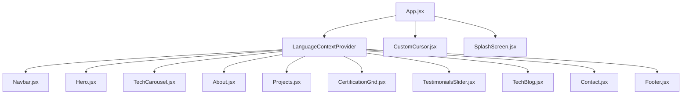

# ⚡ Leo Syafiq | Premium Bilingual Virtual Assistant Portfolio

An ultra-premium, highly interactive, and responsive personal portfolio website built using **React**, scaffolded with **Vite**, and beautifully styled using bespoke **Vanilla CSS** with a modern **Glassmorphic** theme.

This workspace showcases a highly organized, responsive, and proactive freelance **Virtual Assistant (VA)** persona helping local and international clients manage and scale daily remote business operations.

---

## ✨ Features & Visual Magic

### 1. 🎨 Visual Experience & Interactions
*   **Bilingual Context (i18n)**: Fully integrated custom lightweight translation framework. Toggle between **Bahasa Indonesia (ID)** and **English (EN)** instantly via the sliding selector button in the floating navigation header to cater to global clients.
*   **Interactive Particle Background**: Performant HTML5 Canvas particle physics rendering circular nodes connected by active translucent cyan/indigo network grids that drift away or snap close based on cursor proximity.
*   **Custom Elastic Cursor Aura**: A circular cursor tracking dot and ring driven by standard spring math (`lerp` algorithm) for fluid lag-motion. Snap-expands and glows when hovering over buttons, social buttons, and nav anchors. Automatically disables itself on mobile/touch interfaces.
*   **Horizontal Infinite Marquee (VA Tools)**: Infinite horizontal sliding logo carousel positioned under the Hero section. Loops seamlessly, features glassmorphic tags representing tools like Google Workspace, Notion, Trello, Slack, Canva, Zoom, and Asana, and pauses automatically when hovered.
*   **Scroll Depth Progress Bar**: A thin, glowing horizontal gradient indicator at the top of the viewport representing the user's reading depth progress dynamically.
*   **Aesthetic Splash Screen**: Pulsing glowing logo loader embedded inside a translucent glass card that dismisses with a smooth scale-down and opacity fade on load.

### 2. 📁 Structured Layout Sections
*   **Hero Section**: Bold welcome greetings, responsive font sizing via CSS `clamp()` bounds, social anchors, and an interactive morphing gradient blob visual.
*   **About Me Section**: Professional narrative biography panel outlining remote work philosophy, core capabilities, quick statistic counters, and an interactive remote career timeline grid.
*   **Featured Work Examples**: Filter tasks (All, Admin, Research, Social Media) dynamically. Features hover image zoom visual effects and technology tags.
*   **Work Specification Modals**: Beautiful overlay popup card containing client contexts, roles, durations, tech stack details, key achievements (e.g. Inbox Zero metrics, timezone calendar setups, Loom onboarding videos), live launch anchors, and source codes.
*   **Verified Credentials Board**: Display of technical certifications (Google Workspace, Meta VA Pro, HubSpot Social Media, Google PM Essentials) in glowing glass panels with official validation links and custom vector SVG icons (docs sheets, assistant headsets, broadcast megaphones, and checklist calendars).
*   **Client Endorsements Carousel**: Auto-looping reviews slider that swaps reviews every 6 seconds, pauses on hover, and features manual slider dot selectors.
*   **Tips & Insights Blog**: Excerpts of productivity tips, remote work methods, and tool deep-dives containing dynamic reading-time counters.
*   **Feedback Form**: Floating input forms featuring state-driven real-time validations (email formats, empty parameters) and an interactive floating Toast notification overlay.

---

## 🛠️ Architecture & Components

The application is structured modularly:



---

## 🚀 Installation & Local Development

To run this application locally on your system, ensure you have [Node.js](https://nodejs.org) installed.

### 1. Clone the Repository
```bash
git clone https://github.com/Leoallogne/VirtualAssistant-portofolio.git
cd VirtualAssistant-portofolio
```

### 2. Install Project Dependencies
Use your terminal inside the project directory to install all npm modules:
```bash
npm install
```

### 3. Start Local Development Server
Launch the local dev server using Vite:
```bash
npm run dev
```
Open your browser and navigate to the address shown in your terminal (usually `http://localhost:5173`).

### 4. Build for Production Compilation
Compile the minified assets to verify zero compile warnings:
```bash
npm run build
```
This builds highly optimized HTML, JS, and CSS files under the `/dist` directory.

---

## 📜 Professional VA Toolset

*   **Google Workspace & MS Office**: Spreadsheets, documents, slides, calendar integrations, Gmail sorting.
*   **Project Management**: Notion workspace architecting, Trello boards, Asana checklists.
*   **Communications**: Slack channels management, Zoom call configurations, Calendly automated scheduling.
*   **Media & Design**: Canva visual styling, Buffer/Hootsuite posting timelines, Loom video documentation.
*   **Design Paradigm**: Modern Dark-Slate Glassmorphic Theme with custom HSL mesh overlays.
*   **Localization**: Lightweight Custom React Context API (ID / EN).
